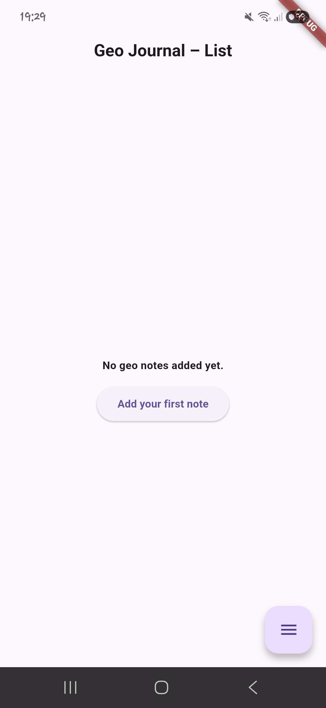
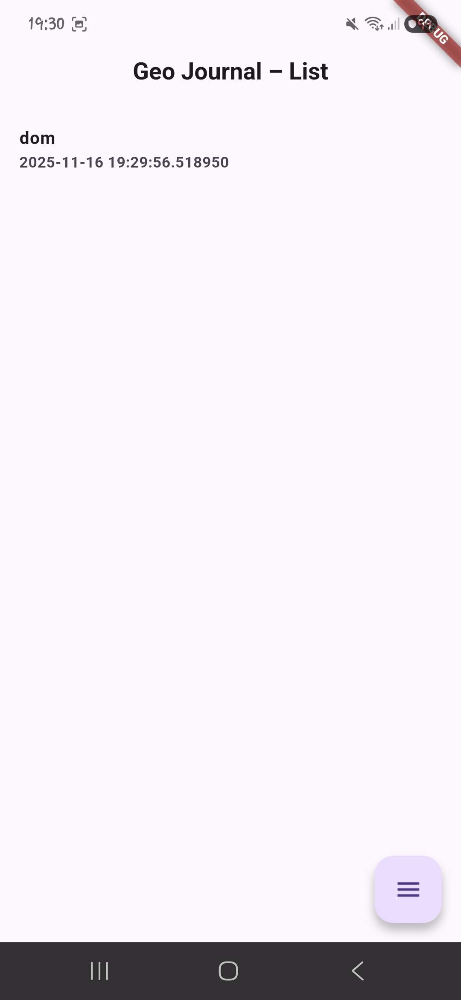
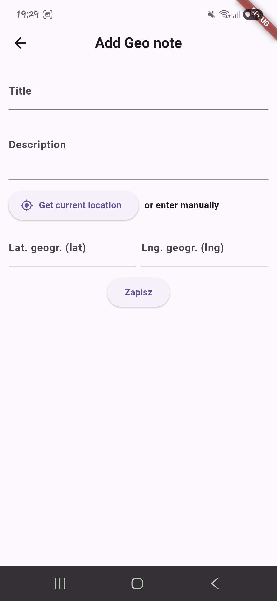
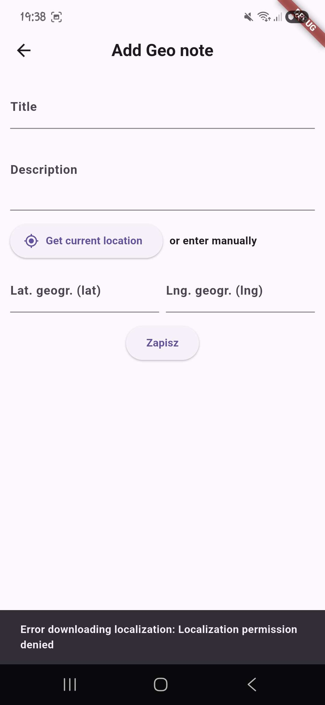
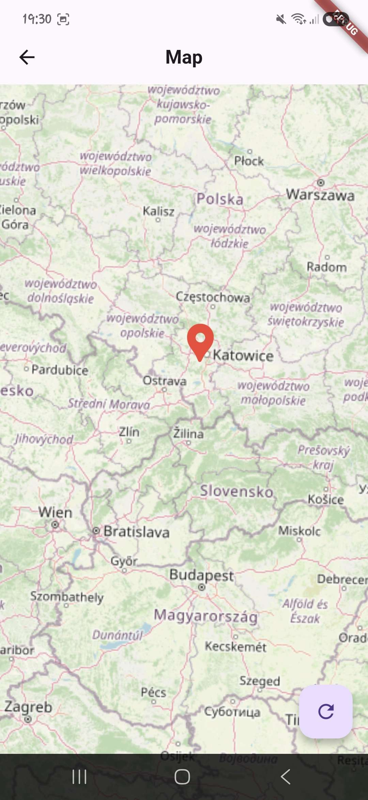
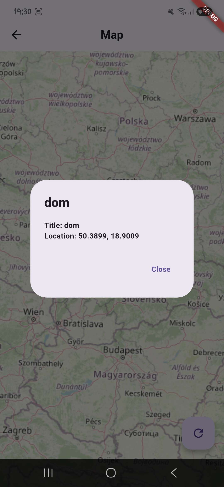
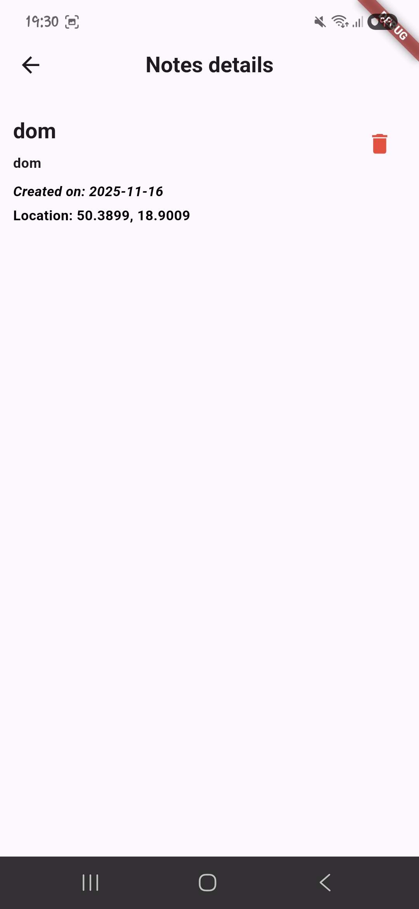
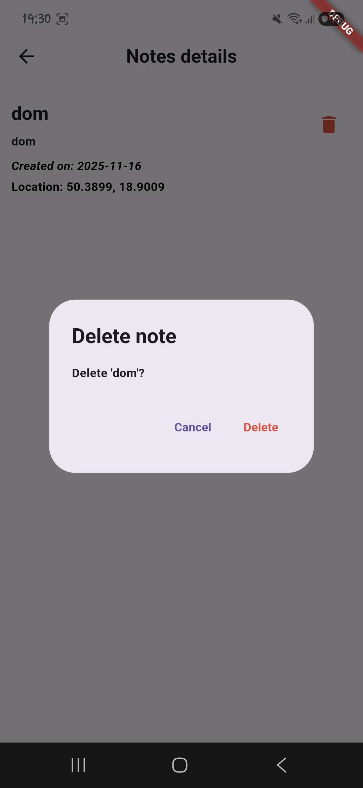

# Flutter – Geo Journal

Podstawowa aplikacja mobilna stworzona w **Flutter (Dart)**.  
Aplikacja pozwala dodawać wpisy z lokalizacją GPS, przeglądać je na liście oraz zobaczyć na mapie.

---

## Funkcje aplikacji

### Widoki (4)
1. **Lista wpisów** – `home.dart`  
   Wyświetla wszystkie dodane wpisy (tytuł, data, lokalizacja).
2. **Dodaj wpis** – `add.dart`  
   Formularz: tytuł, opis + przycisk pobierania lokalizacji GPS. Po dodaniu wykonuje również request do API.
3. **Szczegóły** – `details.dart`  
   Wyświetla szczegółowe dane wpisu.
4. **Mapa** – `map.dart`  
   Pokazuje lokalizacje wpisów w formie pinezek.

---

## Funkcja natywna

Aplikacja korzysta z:
1. **pobierania lokalizacji GPS**

Wybrano to, ponieważ wpisy mają być powiązane z lokalizacjami co pasuje do tematu Geo Jurnal.

---

## Integracja z API

Aplikacja wysyła dane metodą **POST** oraz pobiera je metodą **GET**
logika komunikacji znajduje się w pliku `api.dart`.

---

## Stan aplikacji

Stan przechowywany lokalnie w liście obiektów:
- dodanie wpisu,
- odczyt,
- prezentacja pinezek na mapie.

---

## Edge Cases

- brak uprawnień do GPS – blokada zapisu + komunikat
- brak danych – pusty ekran
- brak tytułu/opisu – komunikat i brak możliwości zapisu

---

## Struktura projektu
1. Struktura:
   ```bash
   lib/  
      ├─ models 
        └─ geo_note.dart    # prosty store 
      ├─ pages/
         ├─ add.dart        # Dodawanie 
         ├─ details.dart    # Szczegóły 
         ├─ home.dart       # lista notatek
         └─ map.dart        # map
      ├─ screenshots/   
         ├─ addScreen.jpg         
         ├─ API.jpg        
         ├─ Details.jpg 
         ├─ emptyhome.jpg 
         ├─ home.jpg 
         ├─ Map.jpg 
         ├─ noteDetails.jpg 
         ├─ permissiondenied.jpg 
         └─ tochPin.jpg          
      └─components/  
         └─ api.dart        #API
---

## Jak uruchomić
1. Zainstaluj zależności:
   ```bash
   flutter pub get   


2. Uruchom aplikację:
   ```bash
   flutter run   
---


## Jak przetestować

1. Dodawanie wpisu: przejdź do Add - wpisz dane - pobierz lokalizację - zapisz  
2. Szczegóły: wyświetlają się po wejściu w w ekran szczegółów  
3. Mapa: otwórz ekran Map i sprawdź pinezki   
5. Brak GPS: odmów zgody i spróbuj zapisać wpis  

## Screenshots

### Lista wpisów




### Dodawanie wpisu



### Mapa



### Szczegóły



## Definition of Done
- [x] 3–4 kompletne widoki zgodne z opisem
- [x] wykorzystano co najmniej 1 funkcję natywną
- [x] integracja z API (min. 1 operacja)
- [x] stany: ładowanie, pusty, błąd
- [x] README + screenshots
- [x] min. 3 commity